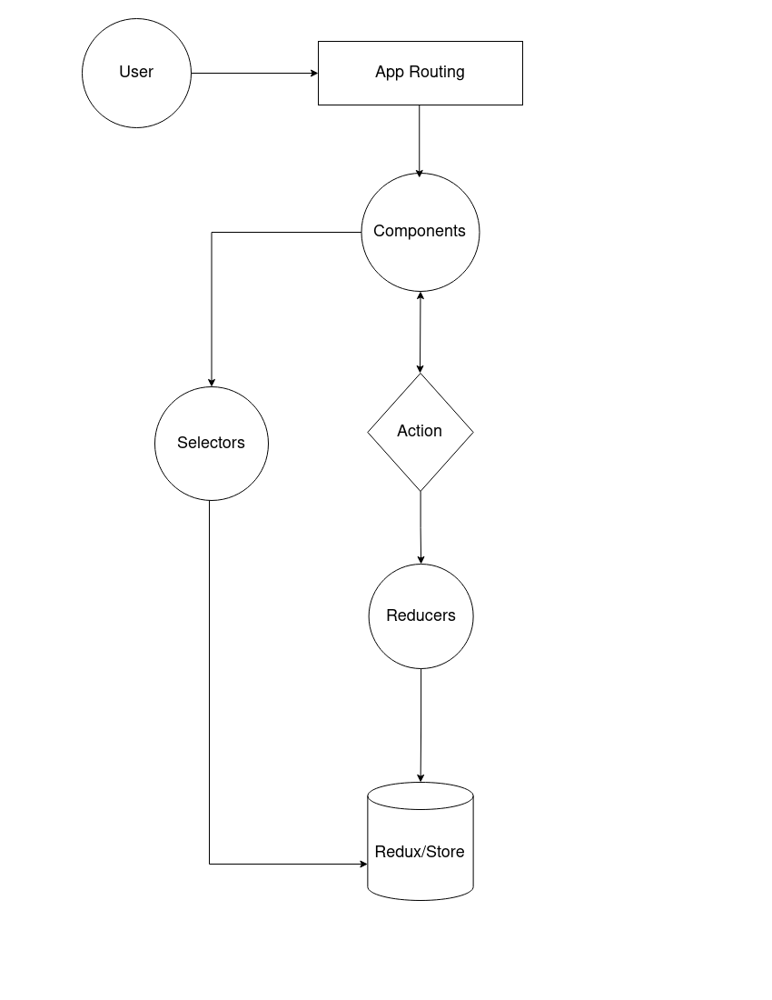
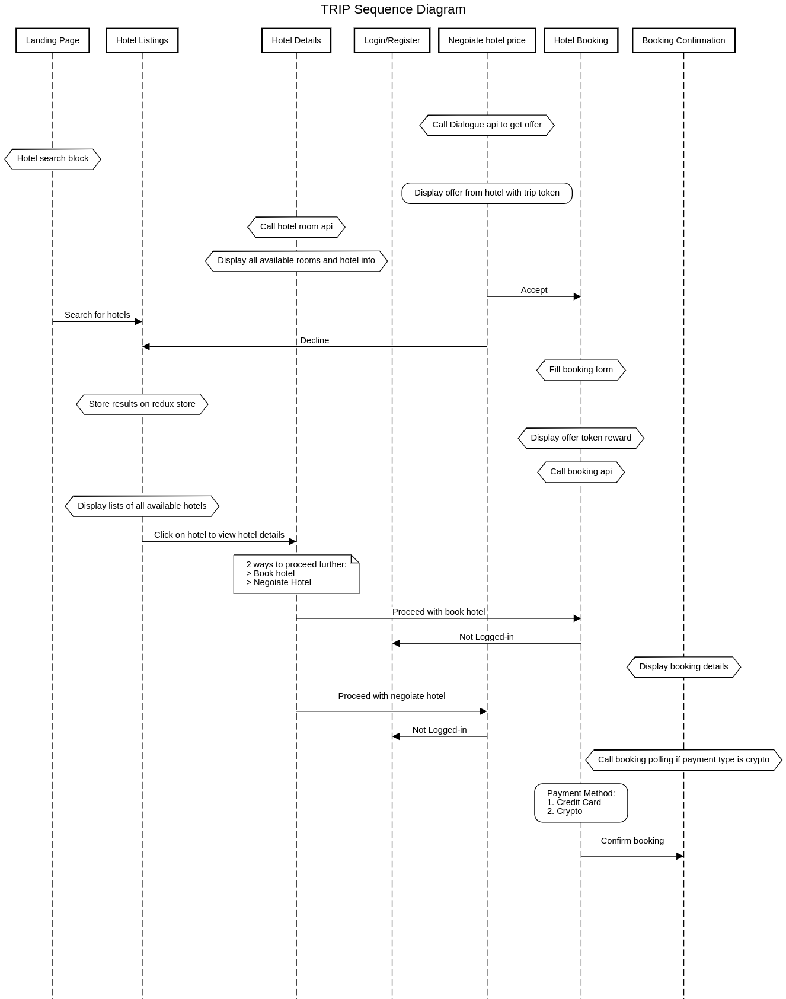
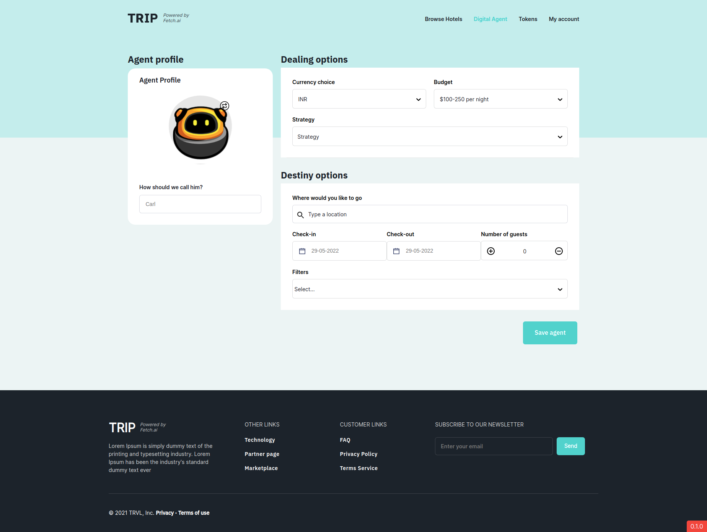
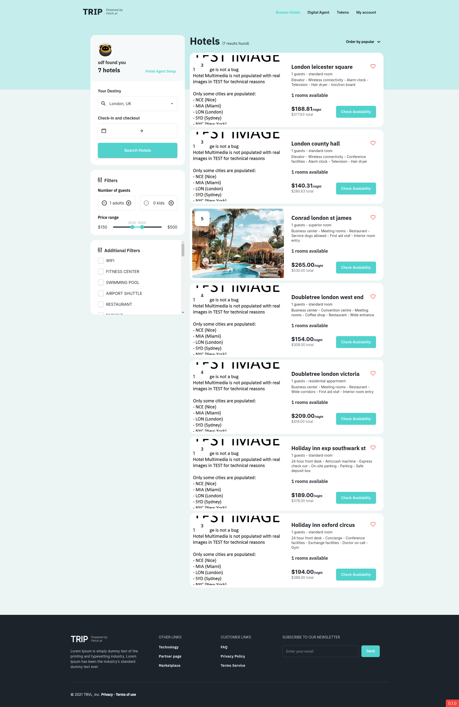
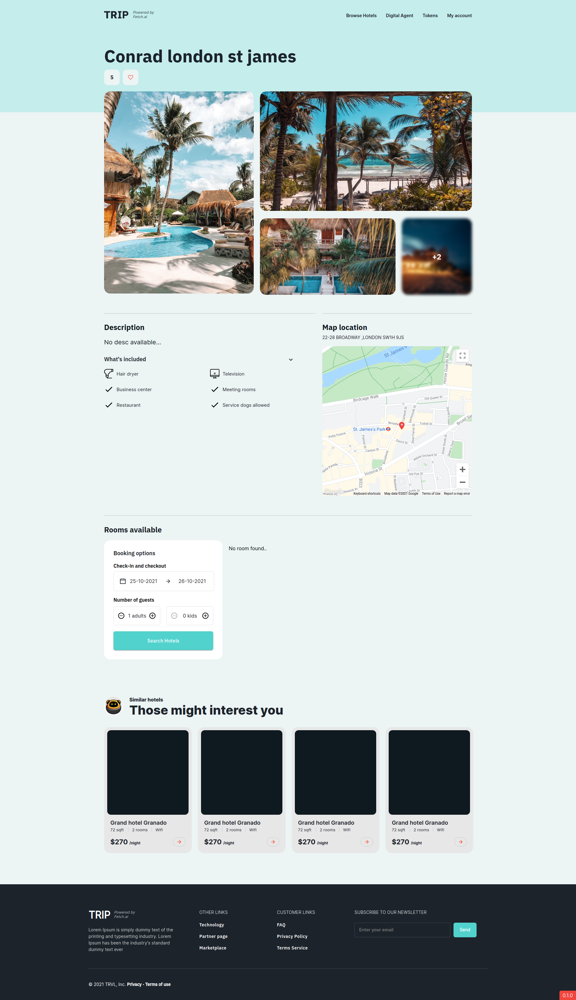
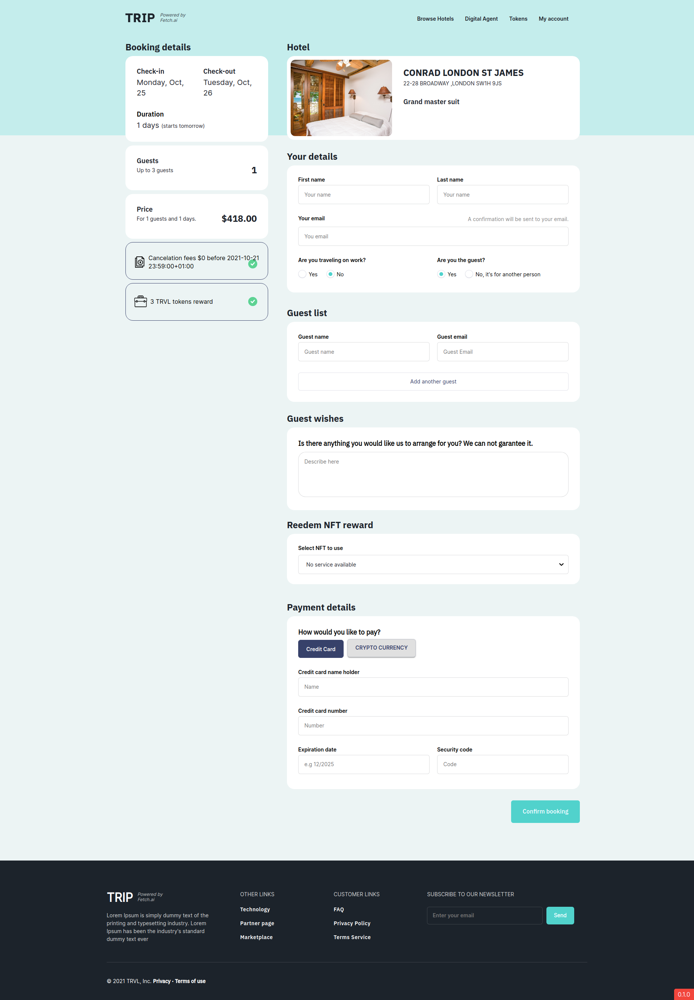

# TRVL booking-frontend Web Application Architecture

## TRVL Booking Frontend

Hotel booking platform for users. It gives an option to deploy your own agents to do the hotel search or directly search the hotels.

## Technologies used

- [React](https://reactjs.org/)
- [Redux-toolkit](https://redux-toolkit.js.org/)
- [React router](https://reactrouter.com/)
- [Material ui](https://material-ui.com/)

## Diagrams

- UI Component Architecture

  <p align="center">
     
  </p>
  <br>

- Flow Sequence
  <p align="center">
     
  </p>
  <br>

## Setup and Run the app

### Setup

- Make sure to be inside the root of the `booking_frontend` directory.

```
  cd booking_frontend
```

- Install all the dependencies:

```
  yarn install or yarn
```

- Create a `.env` file to set `REACT_APP_KEY_GOOGLE` and `REACT_APP_ETHER_WALLET` value. Ask it from any fellow developer.

```
REACT_APP_KEY_GOOGLE=<REACT_APP_KEY_GOOGLE>
REACT_APP_ETHER_WALLET=<REACT_APP_ETHER_WALLET>
```

### Run

- Run the application on `localhost:3000`

```
  yarn start
```

#### Notes

1. [Torus](https://toruswallet.io/) connects to a `Ganace` node running on remote through a local proxy server. It will run with the `yarn start` command itself. To accept localhost certificates on chrome, open `chrome://flags/#allow-insecure-localhost` and enable `Allow invalid certificates for resources loaded from localhost.`.
2. Currently filters on API response based on tags are not in place for the `/search/location` API. Hence the app gets all the hotels irrespective of tags and filtering is being handled locally.
3. Images are hardcoded as of now as the image URL is invalid in the response.
4. Pricing from other services is hardcoded.

## Website Pages

<div align="center">
  <h5>Landing Page</h5>
  
  </br>
  <h5>Agent Page</h5>
  
  </br>
  <h5>Hotels Page</h5>
  
  </br>
  <h5>Details Page</h5>
  
  </br>
  <h5>Booking Page</h5>
  
  </br>
</div>

## Project Directory Structure

```
.
├── conf
├── node_modules
├── public
├── src
│ ├── ABIs
│ │ └── Fetch.json
│ ├── APIs
│ │ ├── APIClient.js
│ │ ├── ClientService.js
│ │ ├── config.js
│ │ ├── helpers.js
│ │ └── HotelService.js
│ ├── App
│ │ ├── App.text.js
│ │ ├── inedx.js
│ │ └── styles.js
│ ├── Assets
│ │ ├── Fonts
│ │ ├── images
│ │ └── index.js
│ ├── Components
│ │ ├── AppHeaders
│ │ ├── BlackDrop
│ │ ├── BookingDetailBox
│ │ ├── DatePicker
│ │ ├── Dialogue
│ │ ├── Dialogues
│ │ ├── Dropdown
│ │ ├── Filter
│ │ ├── FilterBox
│ │ ├── GuestCountTextField
│ │ ├── HotelCard
│ │ ├── HotelModal
│ │ ├── HotelRoom
│ │ ├── HotelRoomRow
│ │ ├── MapMarker
│ │ ├── MatchedHotels
│ │ ├── OfferBox
│ │ ├── PaddingDiv
│ │ ├── PlaceSearch
│ │ ├── Popup
│ │ ├── SearchContainer
│ │ ├── ShowNotification
│ │ ├── WalletModal
│ │ └── index.js
│ ├── Constants
│ │ ├── General.js
│ │ └── Strings.js
│ ├── Containers
│ │ ├── AgentDeploy
│ │ ├── HotelDetails
│ │ ├── Hotels
│ │ ├── Landing
│ │ ├── Map
│ │ ├── Reservation
│ │ ├── Search
│ │ ├── Token
│ │ └── index.js
│ ├── Hooks
│ │ └── usePolling.js
│ ├── Redux
│ │ ├── Reducers
│ │ │ ├── landing.js
│ │ │ └── user.js
│ │ ├── Store
│ │ │ └── index.js
│ │ └── rootReducer.js
│ ├── Router
│ │ └── index.js
│ ├── Theme
│ │ └── index.js
│ ├── Types
│ │ └── Enum.js
│ ├── Utils
│ │ ├── dateTime.js
│ │ ├── hotel.js
│ │ ├── torus.js
│ │ └── index.js
│ ├── index.css
│ ├── index,js
│ └── reportWebVitals.js
├── .env
├── package.json
└── server.js
```
# TRVL
